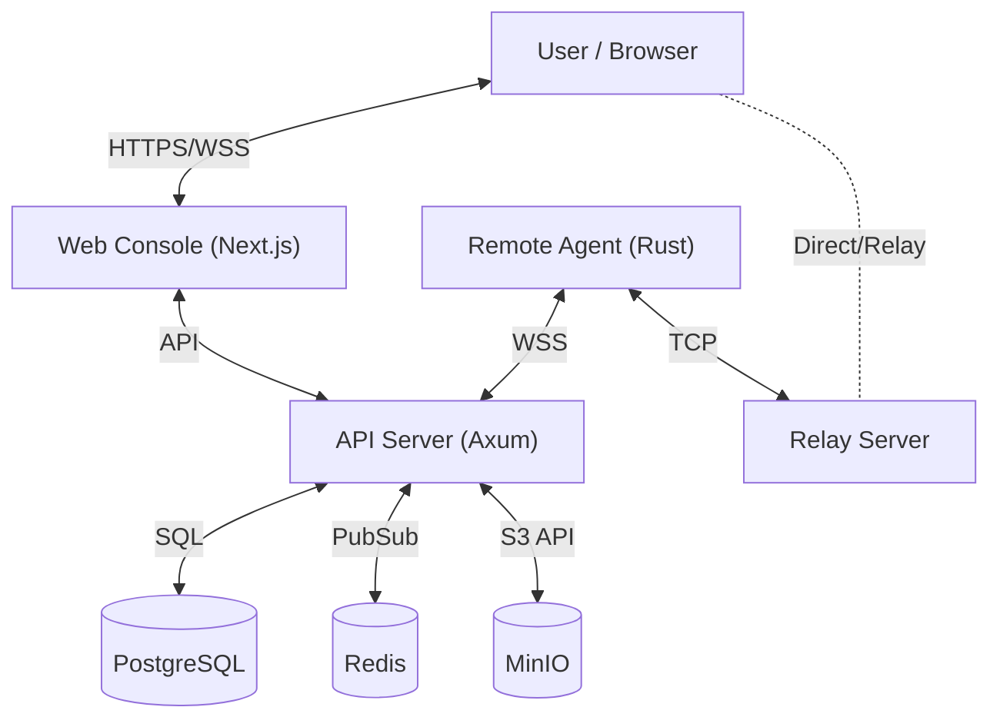

# ScreenControl

## Overview

**ScreenControl** is a modern, high-performance remote desktop and fleet management solution designed for speed, security, and simplicity. Built with Rust and Next.js, it offers a lag-free experience for managing thousands of devices from a single pane of glass.

Unlike SaaS solutions (like TeamViewer or ScreenConnect) that charge per-technician or per-endpoint, ScreenControl gives you complete ownership of your data and infrastructure. Whether you are an **MSP** managing client workstations, a **DevOps engineer** monitoring servers, or an **IT department** supporting a remote workforce, ScreenControl provides the critical tools you need—Remote Desktop, Terminal Access, File Transfer, and Auditing—without the recurring costs or privacy concerns.


## Features


### 🖥️ Remote Support & Control
Initiate remote control sessions instantly. ScreenControl supports full PTY-backed terminals, desktop streaming, and file management.


### 🛡️ Fleet Access
Manage your entire fleet from a single pane of glass. secure unattended access to servers and workstations.


### 🧰 Toolbox & Scripts
Execute pre-defined scripts and tools across your managed devices.


### 📊 Reports & Auditing
Track session history, system health, and administrative actions with detailed reporting and audit logs.
| Reports | Audit Log |
|---------|-----------|
|  |  |

---

## Advanced Capabilities

### 🧩 Extensions & Automation
Extend functionality with plugins and automate routine maintenance tasks using the built-in scheduler.
| Extensions | Scheduled Tasks |
|------------|-----------------|
|  |  |

### 🤝 Collaboration
Collaborate with your team using built-in notifications and meeting tools.
| Notifications | Meetings |
|---------------|----------|
|  |  |

---

## Administration

Comprehensive system management allows you to configure security policies, general settings, and monitor system performance.

| System Health | Security Settings | General Config |
|---------------|-------------------|----------------|
|  |  |  |

---

## Architecture

ScreenControl follows a microservices-inspired architecture for scalability and fault tolerance.



| Component | Tech Stack | Description |
|-----------|------------|-------------|
| **Server** | Rust (Axum) | High-performance API and WebSocket gateway. Handles session management, auth, and agent coordination. |
| **Agent** | Rust | Lightweight binary running on target machines. Handles PTY spawning, screen capture, input injection, and file operations. |
| **Web** | Next.js 16 | Modern React-based dashboard. Uses Server Components for data fetching and client components for interactive sessions. |
| **Relay** | Rust | Traversal server for NAT busting. Allows connections when direct P2P or server-mediated connections fail. |

### 🧠 Deep Dive: How it Works

#### 1. Agent Connection & Auth
The `sc-agent` binary initiates a WebSocket connection to the server's `/ws/agent` endpoint. It authenticates using a pre-generated **Enrollment Token**.
1.  Admin generates a token in the dashboard.
2.  Agent starts with `--token <TOKEN>`.
3.  Server validates token, registers the agent in Redis, and marks it "Online".

#### 2. PTY Streaming (Terminal)
When a user opens a terminal session:
1.  **Browser** connects to Server via WebSocket (`/ws/client/session`).
2.  **Server** signals **Agent** to spawn a PTY (Pseudo-Terminal) process (e.g., `/bin/bash` or `powershell.exe`).
3.  **Agent** captures `stdout`/`stderr` from the PTY and streams it via binary WS frames to the Server.
4.  **Server** relays frames to the Browser.
5.  **Browser** (xterm.js) renders the text. Keystrokes flow in reverse.

#### 3. The Relay Server
Direct connections between users and agents aren't always possible due to NATs/Firewalls. The **Relay Server** acts as a middleman.
-   If a direct connection fails, both the Browser and the Agent connect to `sc-relay`.
-   The relay blindly pipes TCP traffic between the two peers using a `SessionID` to match them.
-   This ensures connectivity even behind strict corporate firewalls.

---

## 🚀 Quick Start (Docker Compose)

The fastest way to get ScreenControl running. Docker Compose stands up the **server**, **web console**, **relay**, and all backing services (PostgreSQL, Redis, MinIO).

> **Note**: The agent binary runs directly on the target machines you want to manage — it is **not** part of the Docker stack.

### Prerequisites
- Docker Engine 24+ & Docker Compose v2
- 2 GB RAM minimum

### 1. Clone & Configure
```bash
git clone https://github.com/theonlytruebigmac/screencontrol.git
cd screencontrol
cp .env.example .env
```

Edit `.env` and update the following:

| Variable | What to set |
|----------|-------------|
| `SC__AUTH__JWT_SECRET` | **Required** — a long random string (e.g. `openssl rand -hex 32`) |
| `NEXT_PUBLIC_API_URL` | The URL clients use to reach the API (e.g. `http://YOUR_IP:8080/api`) |
| `NEXT_PUBLIC_WS_URL` | The URL clients use for WebSocket (e.g. `ws://YOUR_IP:8080/ws`) |

> The web container bakes `NEXT_PUBLIC_*` values at build time. If you change them later, rebuild with `docker compose up -d --build web`.

### 2. Start Services
```bash
docker compose up -d --build
```

This builds and starts five containers:

| Container | Port | Description |
|-----------|------|-------------|
| **postgres** | 5432 | PostgreSQL 16 database |
| **redis** | 6379 | Redis 7 session & pub/sub |
| **minio** | 9000 / 9001 | S3-compatible storage (files, recordings, thumbnails) |
| **sc-server** | 8080 | Rust API + WebSocket gateway |
| **sc-relay** | 8041 | NAT traversal relay |
| **web** | 3000 | Next.js dashboard |

### 3. Login
Navigate to `http://localhost:3000`:

- **Email**: `admin@screencontrol.local`
- **Password**: `admin`

> Change the default password immediately under **Profile → Security**.

### 4. Deploy an Agent
See [Building the Agent](#-building-the-agent-sc-agent) below, or download a pre-built binary from GitHub Releases.

```bash
# On the target machine:
SC_SERVER_URL=ws://YOUR_SERVER:8080/ws/agent \
SC_TENANT_TOKEN=sc-default-token-change-me \
  ./sc-agent
```

The agent auto-registers and appears in the dashboard within seconds.

---

## 🛠️ Build from Source

### Prerequisites (all components)

| Tool | Version | Install |
|------|---------|---------|
| **Rust** | 1.83+ | [rustup.rs](https://rustup.rs) |
| **Node.js** | 22+ | [nodejs.org](https://nodejs.org) |
| **Protobuf** | 3.x | `apt install protobuf-compiler` / `brew install protobuf` |

---

### 🖥️ Building the Server (`sc-server`)

The server has no platform-specific dependencies beyond Rust and protoc.

```bash
cd server
cargo build --release -p sc-server
# Binary: target/release/sc-server
```

#### Running locally (requires PostgreSQL, Redis, MinIO):
```bash
source .env
cargo run --release -p sc-server
```

---

### 📡 Building the Relay (`sc-relay`)

```bash
cd server
cargo build --release -p sc-relay
# Binary: target/release/sc-relay
```

---

### 🤖 Building the Agent (`sc-agent`)

The agent binary runs on target machines. It has **platform-specific dependencies** for screen capture, audio, input injection, and D-Bus integration.

#### Linux (x86_64 / aarch64)

Install system dependencies first:

```bash
# Debian / Ubuntu
sudo apt install -y \
  build-essential pkg-config cmake nasm \
  libx11-dev libxcb1-dev libxcb-randr0-dev libxcb-shape0-dev libxcb-xfixes0-dev \
  libxi-dev libxtst-dev libxdo-dev \
  libdbus-1-dev \
  libpipewire-0.3-dev \
  libasound2-dev \
  libopus-dev \
  libgtk-3-dev libwebkit2gtk-4.1-dev \
  libgstreamer1.0-dev gstreamer1.0-plugins-base gstreamer1.0-plugins-good \
  python3 python3-gi gir1.2-glib-2.0

# Fedora / RHEL
sudo dnf install -y \
  gcc gcc-c++ cmake nasm pkg-config \
  libX11-devel libxcb-devel libXi-devel libXtst-devel libxdo-devel \
  dbus-devel \
  pipewire-devel \
  alsa-lib-devel \
  opus-devel \
  gtk3-devel webkit2gtk4.1-devel \
  gstreamer1-devel gstreamer1-plugins-base \
  python3 python3-gobject
```

Build:
```bash
cd server
cargo build --release -p sc-agent
# Binary: target/release/sc-agent
```

#### macOS (Apple Silicon / Intel)

```bash
# Install Xcode Command Line Tools (includes ScreenCaptureKit)
xcode-select --install
brew install cmake nasm opus pkg-config

cd server
cargo build --release -p sc-agent
```

#### Windows

```powershell
# Install Visual Studio Build Tools with C++ workload
# Install CMake and NASM, ensure they're on PATH

cd server
cargo build --release -p sc-agent
# Binary: target\release\sc-agent.exe
```

#### Deploying the Agent

After building, copy the binary + helper script to the target machine:

```bash
# Copy to target
scp target/release/sc-agent user@target:/opt/screencontrol/
scp scripts/sc_capture_thumbnail.py user@target:/opt/screencontrol/

# On the target machine — run as a service or directly:
SC_SERVER_URL=ws://your-server:8080/ws/agent \
SC_TENANT_TOKEN=your-enrollment-token \
  /opt/screencontrol/sc-agent
```

**Systemd service** (recommended for Linux):
```ini
# /etc/systemd/system/sc-agent.service
[Unit]
Description=ScreenControl Agent
After=network-online.target graphical.target
Wants=network-online.target

[Service]
Type=simple
ExecStart=/opt/screencontrol/sc-agent
Environment=SC_SERVER_URL=ws://your-server:8080/ws/agent
Environment=SC_TENANT_TOKEN=your-enrollment-token
Restart=always
RestartSec=5

[Install]
WantedBy=multi-user.target
```
```bash
sudo systemctl enable --now sc-agent
```

---

### 🌐 Building the Web Console

The web console is a Next.js 16 app that connects to the API server.

```bash
cd web
npm ci
```

#### Development (hot reload):
```bash
# Set API/WS URLs for local dev
export NEXT_PUBLIC_API_URL=http://localhost:8080/api
export NEXT_PUBLIC_WS_URL=ws://localhost:8080/ws

npm run dev
# → http://localhost:3000
```

#### Production build:
```bash
NEXT_PUBLIC_API_URL=http://your-server:8080/api \
NEXT_PUBLIC_WS_URL=ws://your-server:8080/ws \
  npm run build

npm start
# → http://localhost:3000
```

> `NEXT_PUBLIC_*` variables are embedded at build time. You must rebuild if the server URL changes.

---

### 🪟 Building the Viewer (Tauri Desktop App)

The standalone viewer is a Tauri v2 + React + Vite desktop application. It connects directly to ScreenControl sessions via deep links (`screencontrol://session/...`).

#### Prerequisites
- Rust 1.83+
- Node.js 22+
- Tauri v2 CLI: `cargo install tauri-cli@^2`
- Platform-specific Tauri deps (see [Tauri Prerequisites](https://v2.tauri.app/start/prerequisites/))

```bash
# Linux — install Tauri system deps
sudo apt install -y libgtk-3-dev libwebkit2gtk-4.1-dev \
  libappindicator3-dev librsvg2-dev patchelf

# macOS — Xcode is sufficient
# Windows — Visual Studio Build Tools + WebView2
```

#### Development:
```bash
cd viewer
npm ci
npm run tauri dev
```

#### Production build:
```bash
cd viewer
npm ci
npm run tauri build
# Output: src-tauri/target/release/bundle/
```

---

## 🚢 Production Deployment

### Nginx Reverse Proxy

```nginx
server {
    listen 80;
    server_name screencontrol.example.com;
    return 301 https://$host$request_uri;
}

server {
    listen 443 ssl http2;
    server_name screencontrol.example.com;

    ssl_certificate /etc/letsencrypt/live/screencontrol.example.com/fullchain.pem;
    ssl_certificate_key /etc/letsencrypt/live/screencontrol.example.com/privkey.pem;

    # Web console
    location / {
        proxy_pass http://localhost:3000;
        proxy_set_header Host $host;
        proxy_set_header X-Real-IP $remote_addr;
        proxy_set_header X-Forwarded-For $proxy_add_x_forwarded_for;
        proxy_set_header X-Forwarded-Proto $scheme;
    }

    # API
    location /api {
        proxy_pass http://localhost:8080;
        proxy_set_header Host $host;
        proxy_set_header X-Real-IP $remote_addr;
    }

    # WebSocket (agents + clients)
    location /ws {
        proxy_pass http://localhost:8080;
        proxy_http_version 1.1;
        proxy_set_header Upgrade $http_upgrade;
        proxy_set_header Connection "upgrade";
        proxy_set_header Host $host;
        proxy_read_timeout 86400;
    }
}
```

### Production Docker Compose

A separate `docker-compose.production.yml` is provided with TLS, resource limits, and logging configured. See the file for details.

---

## 💻 Development

### Running Tests
```bash
cd server && cargo test --workspace
cd web && npm run lint
```

### Linting
```bash
cd server && cargo clippy --workspace
cd web && npm run lint
```

---

## Configuration Reference

| Variable | System | Description | Default |
|----------|--------|-------------|---------|
| `SC__DATABASE__URL` | Backend | Postgres connection string | `postgres://...` |
| `SC__REDIS__URL` | Backend | Redis connection string | `redis://...` |
| `SC__AUTH__JWT_SECRET` | Backend | **REQUIRED**. Signing key | *None* |
| `SC__S3__ENDPOINT` | Backend | MinIO/S3 endpoint URL | `http://minio:9000` |
| `SC__S3__BUCKET` | Backend | Bucket name for files | `screencontrol` |
| `SC_SERVER_URL` | Agent | Server WebSocket URL | `ws://localhost:8080/ws/agent` |
| `SC_TENANT_TOKEN` | Agent | Enrollment token | `sc-default-token-change-me` |
| `NEXT_PUBLIC_API_URL` | Frontend | API URL for browser | `http://localhost:8080/api` |
| `NEXT_PUBLIC_WS_URL` | Frontend | WS URL for browser | `ws://localhost:8080/ws` |

## License
Distributed under the MIT License. See `LICENSE` for more information.
